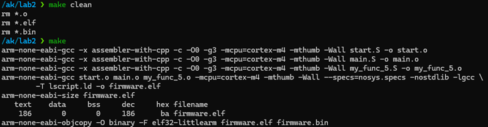
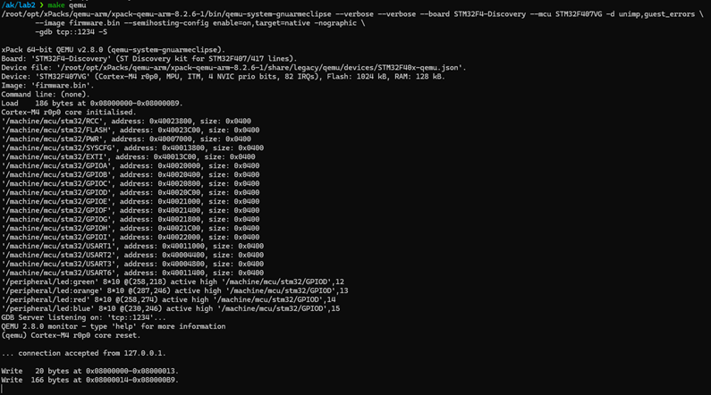
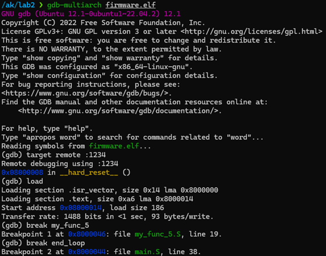
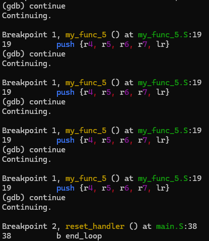
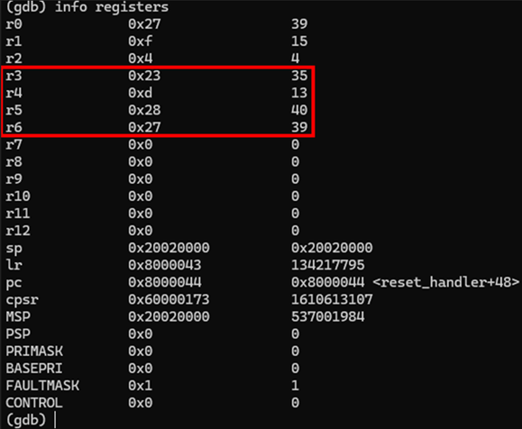

# Архітектура комп’ютерів 3. Мікропроцесорні системи  
## Лабораторна робота №2
### Виконав: Прохоренко Артем Дмитрович, ІО-23
### Варіант: 5
---

## Мета роботи
Навчитися використовувати асемблерні інструкції ядра Cortex-M4, працювати з процедурами і базово зрозуміти архітектуру ядра. Навчитися розуміти синтаксис мови асемблера GAS (GNU Assembly), що є частиною стандартного пакету тулчейну GCC (GNU Compiler Collection) для арм (arm-none-eabi-). Навчитися працювати з GDB відлагоджувачем.

## Обрана функція

Нехай:
- a,b,c,R ∈ N
- P= a × b
  
Тоді функція обчислюється за наступною формулою:

### R =
- якщо P < 10: (P << 2) + (c >> 1)
- якщо 10 ≤ P < 20: (P >> 1) ^ (b << 1)
- якщо 20 ≤ P < 50: (a + b + c) * (a & b)
- якщо P ≥ 50: factorial(c) + (a | b)

де:
-	≪ - зсув вліво,
-	≫ - зсув вправо,
-	⊕ - побітове XOR (виключне або),
-	∧ — побітове AND,
-	∨ — побітове OR.

## Структура проєкту

```
lab2/
├── main.S         # Основна функція reset_handler
├── my_func_5.S    # Функція з логікою умов
├── start.S        # Ініціалізація та вектор переривань
├── lscript.ld     # Лінкерний скрипт
├── Makefile       # Сценарій збирання
```

## Теоретичні обчислення прикладів

| Приклад | a | b | c | P=a\*b | Умова         | Очікуване значення                          |
|---------|---|---|---|--------|----------------|----------------------------------------------|
| #1      | 2 | 4 | 6 | 8      | P < 10         | (8 << 2) + (6 >> 1) = 32 + 3 = **35**        |
| #2      | 3 | 5 | 2 | 15     | 10 ≤ P < 20    | (15 >> 1) ^ (5 << 1) = 7 ^ 10 = **13**       |
| #3      | 5 | 4 | 1 | 20     | 20 ≤ P < 50    | (5+4+1) * (5 & 4) = 10 * 4 = **40**          |
| #4      | 7 | 8 | 4 | 56     | P ≥ 50         | 4! + (7 \| 8) = 24 + 15 = **39**             |


## Результати тестування












## Висновок

У межах лабораторної роботи було успішно реалізовано та протестовано асемблерну функцію, яка реалізує чотири різні логічно-арифметичні гілки в залежності від значення добутку аргументів. Програма обчислює результат за умовною конструкцією, яка охоплює побітові операції, зсуви, арифметику та рекурсивний факторіал. Було виконано точне покрокове налагодження за допомогою gdb через емулятор QEMU для Cortex-M4, що дозволило перевірити правильність кожної гілки виконання. Результати, отримані в регістрах після виклику функції, повністю відповідають теоретично очікуваним. Це підтверджує коректність як обчислювальної логіки, так і реалізації на рівні асемблерного коду. Таким чином, лабораторна робота дозволила закріпити знання про побудову умовних переходів, маніпуляції з регістрами, використання стеку, а також про налагодження коду в архітектурі ARM.

